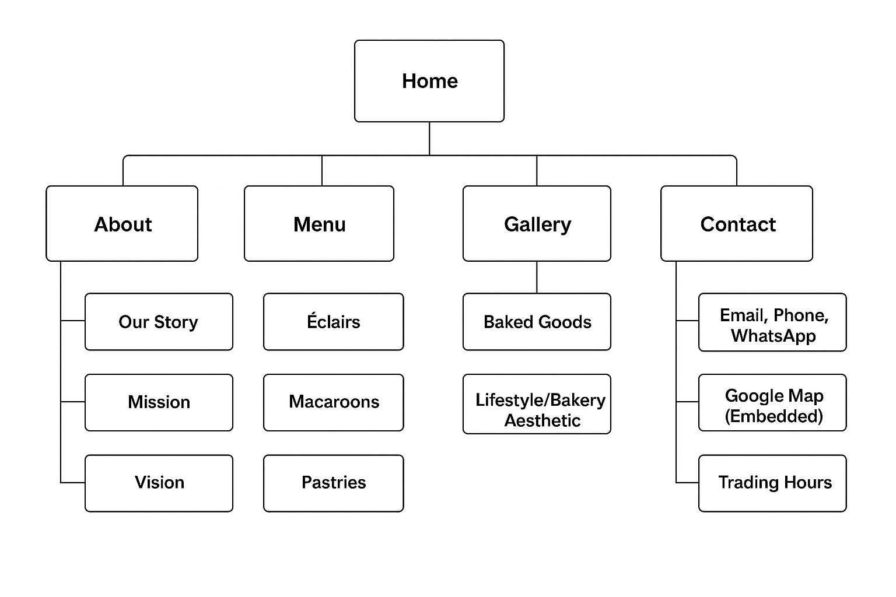

# 1. Project title:
Madam Macaroon POE Part 1
# 2. Student Information:
Student Name: Unathi Nyoni 
Student Number:St10490679

## Overview:

Madame Macaron is a home-based baking business founded in 2025 by a passionate self-taught baker in Johannesburg. The brand introduces South Africans to the delicate charm of Parisian desserts, from crispy éclairs to colourful, chewy macarons, freshly baked in small batches. What began as a hobby quickly turned into a small business through word-of-mouth and Instagram orders. Now, the business is expanding online to reach more dessert lovers across the country.

## Goals and objectives:

Create a visually appealing online platform to showcase products.
Allow customers to place orders easily through an online form or WhatsApp link.
Build brand identity and customer loyalty.
Share the story behind the baking and build connection with followers.

## Key features and functionality:

Navigation bar on every page for easy access to all sections (Home, About, Menu, Gallery, Contact).
	•	Consistent logo placement to maintain brand identity.
	•	Clear headings and subheadings to organise content on each page.
	•	Text and images combined to showcase products and create an engaging experience.
	•	Structured page layout with sections such as introduction, content, and footer.
	•	Internal links that connect all pages for smooth navigation.
	•	External link (email link) for customer inquiries.
	•	Embedded Google Map on the Contact page to show location.
	•	Trading hours information for customer reference.
	•	Product information with prices and descriptions on the Menu page.
	•	Image gallery to highlight baked goods and the lifestyle of the bakery.

## Timeline:
• Week 1–2: Research and branding.
•	Week 3: Wireframe design and homepage layout.
•	Week 4–5: Build web pages.
•	Week 6: Mobile testing.
•	Week 7: Feedback collection.
•	Week 8: Site launch.

## Part 1 details:
-project plan 
-html structure for all pages no CSS
-images included
-basic navigation between pages 

## Sitemap

## Changelog: Part 1 poe 
22 August 2025 – Day 1
	•	Created the initial sitemap to plan website structure and navigation flow.

23 August 2025 – Day 2
	•	Built the Homepage with a header, navigation menu, welcome text, and featured bakery items.

24 August 2025 – Day 3
	•	Developed the About Us page.
	•	Added sections for Our Story, Mission, Vision, and Why Choose Us.
	•	Inserted two images showcasing the restaurant’s vibe.

25 August 2025 – Day 4
	•	Completed the Menu page.
	•	Added a list of products with prices and short descriptions.

26 August 2025 – Day 5
	•	Created the Gallery page with images of baked goods and bakery lifestyle photos.
 ## PART 2 POE changelog 
25 September 2025 
### Index pages changes:
  • Expanded the index.html page to make it more content rich 
  • Rewrote the introduction to better describe Madam macaroo's prouducts and inspiration 
  • Improved the overall layout and read

26 September 2025
### Gallery Page changes:
• Added semantic structure: head,main and footer
• Added navigation to match the other pages 
• Removed unnecessary Div tag 
•Wrote new intoduction and closing to make it more content rich 
### Readme files chnages:
Improved formatting and addeed the appropriate headings 
## Proposal document changes:
•Further decomposed my timeline to show every milestone 
•updated my gantt chart 
•Improved the budgt estimation by allocationg funds to diffrent activities 

20 September 2025 
## css file 
created the styles.css file and linked it to all my pages 

22 September 2025 
## styling 
styled my header section and changed the layout of my navigation bar 
applied google fonts for a cleaner look 

24 September 2025 
## image gallery 
Added initial image grid to gallery.html with placeholder images
Implemented basic hover effects

26 September 2025 
## responsive design 
Introduced CSS Grid and Flexbox for mobile-friendly layouts
Added media queries for tablet (768 px) and mobile (480 px) breakpoints

27 September 2025 
## Performance 
Compressed large images for faster load times
Added alt text to all images for screen readers
Used Microsoft Edge DevTools to emulate Desktop, Tablet, and Mobile viewports
Fixed padding issues on small screens after testing
 
 29 September 2025 
 ## Final Polish 
Added “Order Now” button to Gallery and Products pages
Adjusted hover animations so images scale smoothly on all devices
Updated README with responsive screenshots.

## Testing Process Images 
 
Tablet view 

Desktop view

Phone view

## Refrences:
 •	Afrihost, 2025. Web Hosting for South Africans. [online] Available at: https://www.afrihost.com [Accessed 6 Aug. 2025].

•	Wix, 2025. Website Inspiration for Bakeries. [online] Available at: https://www.wix.com/website/templates/html/food-cake [Accessed 6 Aug. 2025].

•	Baked by Jemma, 2024. Home Bakery Design Tips. [online] Available at: https://bakedbyjemma.com/blog [Accessed 7 Aug. 2025].

•	Dog Adoption South Africa, 2025. Dog Adoption South Africa. [online] Available at: https://dogadoptionsa.co.za [Accessed 4 Aug. 2025].

•	Website Design Journal, 2024. Non-profit Website Best Practices. [online] Available at: https://websitedesignjournal.org/nonprofit-best-practices [Accessed 6 Aug. 2025].

•	Afrihost, 2025. Web Hosting Packages. [online] Available at: https://www.afrihost.com [Accessed 6 Aug. 2025].

•	Pinterest (n.d.) Images sourced from Pinterest. Available at: https://www.pintrest.com(Accesssed: 22 August 2025)

MDN Web Docs, n.d. Responsive images. [online] Available at: https://developer.mozilla.org/en-US/docs/Learn/HTML/Multimedia_and_embedding/Responsive_images
 [Accessed 23 Sep. 2025].

MDN Web Docs, n.d. Using media queries. [online] Available at: https://developer.mozilla.org/en-US/docs/Web/CSS/Media_Queries/Using_media_queries
 [Accessed 26 Sep. 2025].

CSS-Tricks, n.d. A Complete Guide to Flexbox. [online] Available at: https://css-tricks.com/snippets/css/a-guide-to-flexbox/
 [Accessed 27 Sep. 2025].